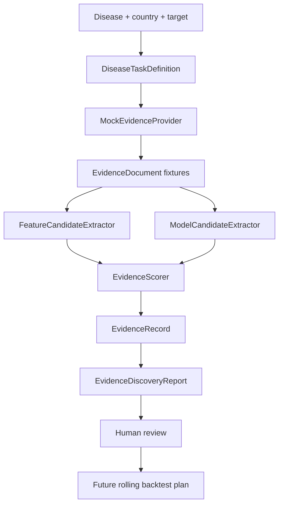

# Milestone 2 Workflow

```mermaid
flowchart TD
    A["Disease + country + target"] --> B["DiseaseTaskDefinition"]
    B --> C["MockEvidenceProvider"]
    C --> D["EvidenceDocument fixtures"]
    D --> E["FeatureCandidateExtractor"]
    D --> F["ModelCandidateExtractor"]
    E --> G["EvidenceScorer"]
    F --> G
    G --> H["EvidenceRecord"]
    H --> I["EvidenceDiscoveryReport"]
    I --> J["Human review"]
    J --> K["Future rolling backtest plan"]
```

The workflow produces candidate strategies. It does not train models or replace production predictors.
